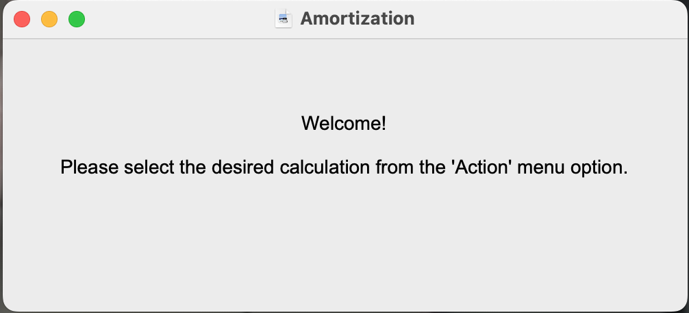
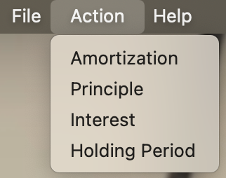
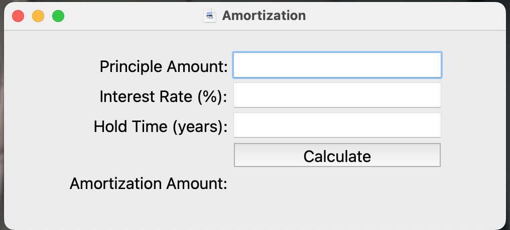

<h1>&nbsp;&nbsp;Amortization</h1>

## Amortization Calculator

### General

Simple desktop process that allows you to calculate amortization scenarios.

### Actions available

* Amortization Amount, given Principle, Inderest rate and Duration.
* Principle Amount, given the desired Amortization Amount for a given Interest rate and Duration.
* The Interest rate based on Amortization Amount, Principle and Duration.
* The Duration needed to obtain given Amortization and Principle amounts; and Interest rate.

### Install

* Optional:

```shell
mkdir {your_desired_directory}
```

* And:

```shell
cd {your_desired_directory}
git clone https://github.com/yveshoebeke/amortization
cd amortization
```

* If you wish create a symbolic link: in you local ```bin``` directory pointing to ```{your_desired_directory}/amortization/amortization```

* Optional create a desktop icon that executes ```{link_to}/amortization```

### Run

From the command shell:

```amortization```

Or click the above mentioned icon.

You will see the *Welcome* screen. 



You now can choose the desired process from the ```Action``` item on the command menu.


The choices are:



After selection you will see a data entry form:


>>>>>>> dev
